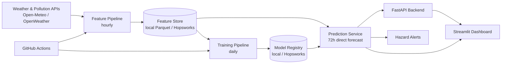

# Pearls AQI Predictor

A primarily-serverless system that forecasts the **US EPA Air Quality Index (AQI)**
for a configurable city for the **next 72 hours**, with an interactive dashboard,
a REST API, automated hourly/daily pipelines, model explainability, and hazard
alerts.

> **Health disclaimer.** These forecasts are model estimates for informational
> purposes only. They **do not replace official government air-quality warnings
> or medical advice.** See [`docs/model_card.md`](docs/model_card.md).

---

## 1. Overview

Pearls AQI Predictor pulls weather and air-pollution observations from public
APIs, engineers time-series features, stores them in a feature store, trains and
compares several forecasting models, registers the best one, and serves an
hourly 3-day AQI forecast through a FastAPI backend and a Streamlit dashboard.

**It runs end-to-end with zero paid services and zero API keys** by defaulting to
the free [Open-Meteo](https://open-meteo.com/) APIs, a local Parquet feature
store, and a local filesystem model registry. Hopsworks (feature store + model
registry) and OpenWeather are drop-in alternatives selected by environment
variables.

### Key properties

- **Runs offline in sample mode** — deterministic synthetic data, no network.
- **No data leakage** — chronological train/val/test splits with gaps; all
  preprocessing fit on training data only; every feature computable at
  prediction time.
- **Graceful degradation** — works even if TensorFlow, SHAP, Hopsworks, or a
  provider is unavailable.
- **Honest** — no fabricated metrics; unrun steps are labelled *Pending*.

---

## 2. Architecture



Four connected stages — **APIs → feature pipeline → training pipeline →
forecasting app** — glued together by the **feature store** and **model
registry**. See [`docs/architecture.md`](docs/architecture.md) for detail.

---

## 3. Technology choices

| Concern            | Choice                                             |
| ------------------ | -------------------------------------------------- |
| Language           | Python 3.11                                        |
| Data               | pandas, NumPy                                       |
| Classical ML       | scikit-learn                                        |
| Deep learning      | TensorFlow/Keras (optional extra)                   |
| Feature store      | Hopsworks **or** local Parquet (default)            |
| Model registry     | Hopsworks **or** local filesystem (default)         |
| Data provider      | Open-Meteo (default, keyless) or OpenWeather        |
| API                | FastAPI                                             |
| Dashboard          | Streamlit + Plotly                                  |
| Explainability     | SHAP (optional) with permutation-importance fallback|
| Validation         | Pydantic                                            |
| Automation         | GitHub Actions                                      |
| Testing            | pytest                                              |
| Quality            | Ruff, Black, mypy                                   |
| Packaging          | `pyproject.toml` (hatchling)                        |
| Containers         | Docker + docker-compose                             |

---

## 4. Repository structure

```text
pearls-aqi-predictor/
├── api/            FastAPI backend (routes, schemas, dependencies)
├── app/            Streamlit dashboard (multipage)
├── config/         YAML config + logging config
├── data/sample/    Committed sample data (sample mode)
├── docs/           Architecture, data dictionary, model card, report, ...
├── notebooks/      Optional EDA & experiments
├── scripts/        CLI entrypoints (feature/backfill/train/forecast/seed)
├── src/pearls_aqi/ Library: aqi, api_clients, config, data, features,
│                   forecasting, models, evaluation, explainability, registry,
│                   storage, alerts, monitoring, utils
├── tests/          unit / integration / contract / smoke + fixtures
├── .github/workflows/  ci, feature_pipeline, training_pipeline, deploy
├── Dockerfile, docker-compose.yml, Makefile, pyproject.toml
```

---

## 5. Prerequisites

- Python **3.11+**
- (Optional) Docker & docker-compose for containerised runs
- (Optional) A Hopsworks account and/or OpenWeather API key for cloud/live modes

---

## 6. Local setup

```bash
# 1. Create a virtualenv and install (editable) with dev tooling
make venv
make install            # or: pip install -e ".[dev]"

# For the deep-learning model + SHAP explainability as well:
#   pip install -e ".[all]"

# 2. Copy example config & env
cp config/config.example.yaml config/config.yaml
cp .env.example .env

# 3. Seed deterministic sample data (no network) and try it end-to-end
make seed               # writes ~180 days of synthetic hourly data locally
make train              # trains & compares models, registers the best
make forecast           # generates a 72h forecast
make api                # FastAPI at http://localhost:8000  (/docs for OpenAPI)
make dashboard          # Streamlit at http://localhost:8501
```

Everything above works **without any API key or account.**

## 7. API-key setup (optional live data)

Open-Meteo needs **no key**. To use OpenWeather instead:

```env
AQI_PROVIDER=openweather
WEATHER_PROVIDER=openweather
OPENWEATHER_API_KEY=your_key_here
```

Get a free key at <https://openweathermap.org/api>. Note the free tier does not
include historical pollution beyond limited windows — see
[`docs/limitations.md`](docs/limitations.md).

## 8. Hopsworks setup (optional cloud storage)

```env
FEATURE_STORE_BACKEND=hopsworks
MODEL_REGISTRY_BACKEND=hopsworks
HOPSWORKS_API_KEY=your_key
HOPSWORKS_PROJECT=your_project
pip install -e ".[hopsworks]"
```

The local Parquet/filesystem backends remain the default so the project is
runnable without an account. See [`docs/deployment.md`](docs/deployment.md).

## 9. Running the feature pipeline

```bash
make features                                  # one hourly ingest + feature build
python scripts/run_feature_pipeline.py --city Karachi
```

## 10. Historical backfill

```bash
python scripts/backfill_historical_data.py \
  --city Karachi --start-date 2024-01-01 --end-date 2026-01-01
# Flags: --dry-run, --batch-days N, --resume (default), --sample
```

Idempotent, resumable, deduplicated, with a written summary and missing-data
report. Falls back to sample generation with `--sample` when live history is
unavailable.

## 11. Training models

```bash
make train
python scripts/run_training_pipeline.py --city Karachi
```

Trains baselines + Ridge/ElasticNet + RandomForest + HistGradientBoosting
(+ TensorFlow if installed), evaluates with chronological validation, selects the
best by validation MAE, and registers it. Writes a model card and training report.

## 12–14. API, dashboard, tests

```bash
make api          # uvicorn api.main:app
make dashboard    # streamlit run app/streamlit_app.py
make test         # pytest
make cov          # pytest with coverage
make check        # format-check + mypy + tests
```

## 15. GitHub Actions setup

Workflows in `.github/workflows/`:

- `ci.yml` — lint, format, mypy, tests, Docker build on push/PR.
- `feature_pipeline.yml` — hourly (`0 * * * *`) ingest + feature build.
- `training_pipeline.yml` — daily (`30 1 * * *`) train + conditional promote.
- `deploy.yml` — deploy API/dashboard on merge to the deploy branch.

Add repository **Secrets** (Settings → Secrets → Actions) as needed:
`OPENWEATHER_API_KEY`, `HOPSWORKS_API_KEY`, `HOPSWORKS_PROJECT`, and any deploy
tokens. Without secrets the pipelines still run in sample mode.

## 16. Deployment

- **Dashboard** → Streamlit Community Cloud (point it at `app/streamlit_app.py`).
- **API** → Render / Railway / Cloud Run (container from `Dockerfile`).
- **Storage** → Hopsworks (feature store + model registry).
- **Orchestration** → GitHub Actions.

Full instructions: [`docs/deployment.md`](docs/deployment.md).

## 17. Troubleshooting

| Symptom                                   | Fix                                                                 |
| ----------------------------------------- | ------------------------------------------------------------------- |
| `No configuration file found`             | `cp config/config.example.yaml config/config.yaml`                  |
| `ModelNotFoundError` on forecast          | Run `make train` first (needs data — run `make seed` before that).  |
| TensorFlow / SHAP import errors           | They are optional; install `".[all]"` or ignore (fallbacks apply).  |
| Dashboard shows "API unreachable"         | Start `make api`, or leave `PEARLS_API_BASE_URL` empty for direct mode. |
| Live provider timeouts                    | Retries are automatic; use `--sample` / sample mode to work offline.|

## 18. Known limitations

See [`docs/limitations.md`](docs/limitations.md). Highlights: forecast skill
degrades with horizon; provider free tiers cap historical depth; O3/SO2 sub-index
above certain concentrations is not modelled; sample data is **synthetic** and
must never be presented as real observations.

## 19. Future improvements

Probabilistic forecasts via quantile models; per-pollutant multi-target models;
online drift-triggered retraining; more cities; caching layer for the API.

## 20. Screenshots

_Placeholders — capture after running `make dashboard`:_ `docs/img/overview.png`,
`docs/img/forecast.png`, `docs/img/explainability.png`.

## 21. Data-source attribution

- Weather & air quality: [Open-Meteo](https://open-meteo.com/) (CC BY 4.0).
- Alternative: [OpenWeather](https://openweathermap.org/).
- AQI methodology: US EPA AQI Technical Assistance Document / AirNow.

## License

MIT — see [`LICENSE`](LICENSE).
