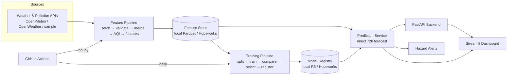

# Architecture

Pearls AQI Predictor is a primarily-serverless system with four connected
stages, glued together by a **feature store** and a **model registry**:



## Stages

1. **Data providers** (`src/pearls_aqi/api_clients/`) — pull hourly weather and
   pollution data behind the `WeatherProvider` / `AirQualityProvider` interfaces.
   Open-Meteo (keyless) is the default; OpenWeather and an offline sample
   provider are drop-in alternatives. Every client has timeouts, retry with
   exponential backoff, rate-limit handling, response validation, and logging.
2. **Feature pipeline** (`src/pearls_aqi/pipelines/feature_pipeline.py`) — merges
   pollution + weather on the hourly UTC timestamp, computes the US-EPA AQI
   target locally (`src/pearls_aqi/aqi.py`), engineers time/cyclical/solar/lag/
   rolling/change/interaction features (`features/engineering.py`), validates
   (`data/validation.py`), and upserts to the feature store.
3. **Training pipeline** (`pipelines/training_pipeline.py`) — reads features,
   builds direct multi-horizon targets, splits chronologically, trains and
   compares baselines + linear + tree + (optional) TF models, selects the best
   by validation MAE, registers it, and conditionally promotes it.
4. **Forecasting app** — the `ForecastService` loads the approved model + latest
   features and emits a 72h forecast; the FastAPI backend serves it and the
   Streamlit dashboard renders it. Hazard alerts are derived from the forecast.

## Abstraction interfaces (swap without rewrites)

| Concern | Interface | Implementations |
| ------- | --------- | --------------- |
| Air-quality data | `AirQualityProvider` (Protocol) | Open-Meteo, OpenWeather, sample |
| Weather data | `WeatherProvider` (Protocol) | Open-Meteo, OpenWeather, sample |
| Feature store | `FeatureStoreRepository` (Protocol) | local Parquet, Hopsworks |
| Model registry | `ModelRegistry` (Protocol) | local filesystem, Hopsworks |
| Forecast model | `ForecastModel` (ABC) | baselines, sklearn, TensorFlow |
| Alert delivery | `AlertChannel` (Protocol) | log, dashboard, email, webhook |

Backends are chosen by environment variable / config:

```env
AQI_PROVIDER=openmeteo         # openmeteo | openweather | sample
FEATURE_STORE_BACKEND=local    # local | hopsworks
MODEL_REGISTRY_BACKEND=local   # local | hopsworks
```

Factories (`api_clients/factory.py`, `storage/factory.py`, `registry/factory.py`)
build the configured implementation and **fall back to the local backend** if a
cloud backend is requested but unavailable (graceful degradation).

## Feature store groups

`raw_air_quality`, `raw_weather`, `aqi_features` (the engineered training
features), `forecast_inputs`, `model_predictions`, `model_monitoring`. Primary
key `city_id + timestamp`; event-time `timestamp`. Names/versions live in
`config/config.yaml` so schema changes are explicit.

## Model registry lifecycle

Models carry a status: `candidate → approved → archived` (or `failed`). The app
always loads the **latest approved** model, never merely the newest file. A newly
trained model is registered as `candidate` and only promoted to `approved` when
it passes the promotion gate (`evaluation/selection.py`): valid data, no schema
mismatch, sufficient MAE improvement, no material hazard-MAE degradation, and a
passing smoke test.

## Time handling

All timestamps are stored and processed in **UTC**. Display-timezone conversion
happens only at the presentation edge (dashboard/API), never inside pipelines.

## Automation (serverless)

GitHub Actions runs the feature pipeline hourly (`0 * * * *`) and the training
pipeline daily (`30 1 * * *`). With Hopsworks configured the state persists in
the cloud; without it, workflows still run (local store is ephemeral in CI but
validates the pipeline). See [`deployment.md`](deployment.md).
